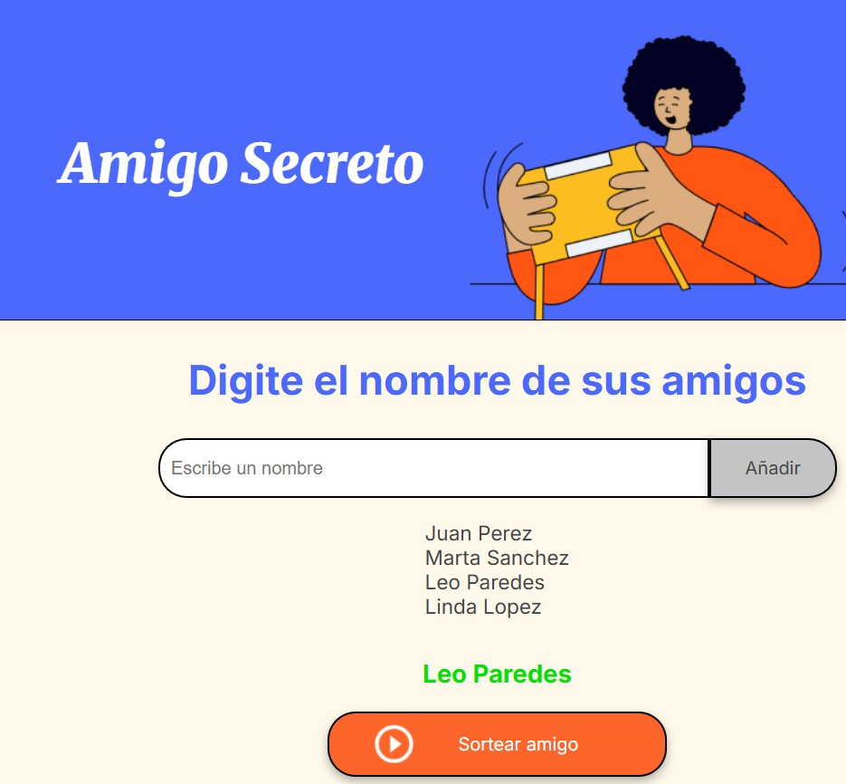

<h1>Juego Amigo Secreto</h1>

### Funcionalidades

Esta aplicación permite gestionar el sorteo del "Amigo Secreto" de manera sencilla.  

A continuación se detallan sus principales funcionalidades:

### 1. Agregar nombres de amigos
- El usuario puede ingresar el nombre de cada amigo en el campo de texto.
- Al hacer clic en el botón "Añadir", el nombre se agrega a la lista de participantes.
- La lista se actualiza automáticamente mostrando todos los nombres ingresados.

### 2. Sortear un amigo secreto
- Una vez agregados los nombres, el usuario puede hacer clic en el botón "Sortear amigo".
- Se selecciona aleatoriamente uno de los nombres de la lista y se muestra el resultado en pantalla.

### Capturas

#### Agregar nombres

#### Nombre Agregado 

#### Realizar el sorteo

#### Amigo Sorteado

